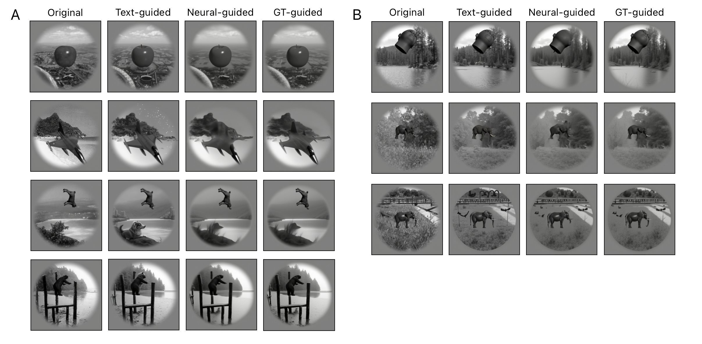
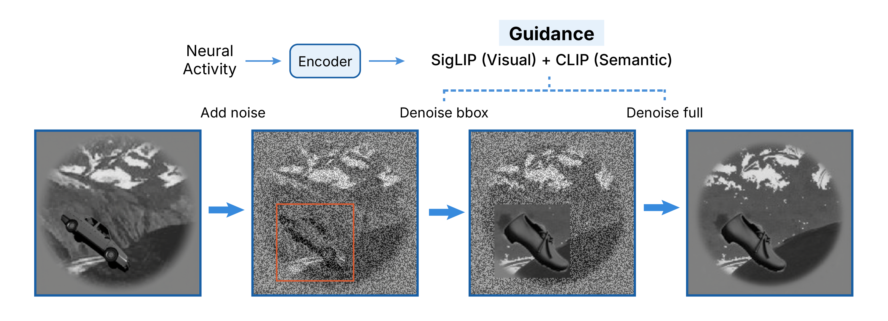
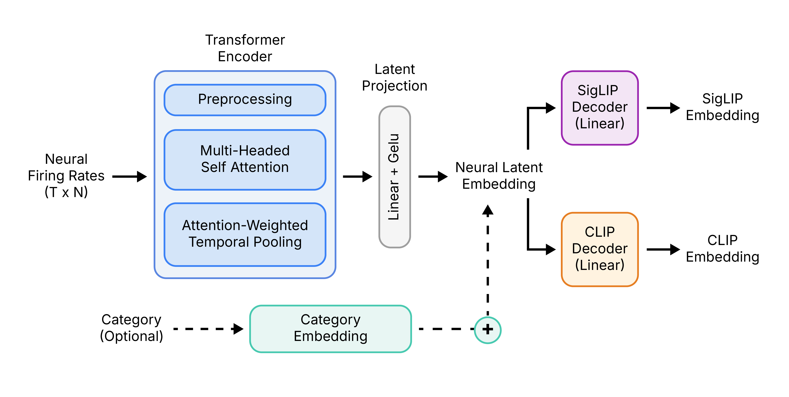

# From Spikes to Scenes: Neural Image Reconstruction from Marmoset Visual Cortex in the Data-Limited Regime

Reconstructs the image a marmoset was looking at, directly from Neuropixels population activity, by decoding neural responses into vision-language embeddings and conditioning a frozen FLUX.1-dev diffusion model on them.

Prior brain-to-image work needs 22,000+ images or thousands of trials. This repo does it with **270 training examples**, the regime typical of primate electrophysiology.



*Original | Text-guided | Neural-guided | GT-guided, for held-out test stimuli.*

---

## How it works

Two lightweight transformer encoders map a 2,330-neuron pseudo-population to SigLIP-SO400M (1152-d) and CLIP (768-d) embeddings. A frozen InstantX IP-Adapter then conditions FLUX.1-dev on those embeddings through a two-pass img2img procedure: pass 1 recovers the object inside its GDINO bounding box, pass 2 rebuilds the full scene around it.



1. **Pass 1 (object recovery).** The GDINO bbox crop is denoised conditioned on `ẑ_sig_obj`, then composited back onto the original to form a spliced latent.
2. **Pass 2 (global recovery).** Starts from the original init latent conditioned on `ẑ_sig_global`. Bbox tokens are blended toward the spliced latent with a cosine-decaying weight (0.6 → 0), anchoring object structure early and releasing it late. Latents outside the circular aperture are pinned to the original.

No adapter finetuning is involved. Everything downstream of the encoders is pretrained and frozen.

---

## Install

Dependencies are pinned in `pyproject.toml` and locked in `uv.lock` ([uv](https://docs.astral.sh/uv/) required, Python 3.12).

```bash
uv sync
```

This creates `.venv/` with the cu124 torch builds. The loaders import `HexPred`, which is not a package dependency and is reached through a path entry, so add one after syncing:

```bash
printf '%s\n' /home/yy3658 /home/yy3658/HexPred /home/yy3658/helpers \
  > .venv/lib/python3.12/site-packages/extra_paths.pth
```

Then run commands with `uv run`, or activate the venv directly:

```bash
source .venv/bin/activate
```

All scripts run from the repo root. Key paths live in `config_const.py`. HVM stimulus images are expected at `stimuli/hvm_nofixation/`, and the caches in `cache/` are built by the scripts in `scripts/`.

## Usage

**Train the encoders.**

```bash
# Global model (full-image SigLIP + CLIP)
uv run python train/train_multihead.py --dataset hvm --use-category

# Object model (bbox-crop SigLIP + CLIP)
uv run python train/train_multihead_obj.py --use-category
```

Best configurations are written to `cache/best_hvm_multihead_config.json` and `cache/best_hvm_multihead_obj_config.json`. Best sweep result: `d_model=64, n_heads=4, n_layers=2, shared_dim=512`.

**Generate reconstructions.**

```bash
uv run python scripts/generate_hvm_obj.py          # all 90 test stimuli
uv run python scripts/generate_hvm_obj.py --n 10   # first 10 only
```

Outputs land in `outputs/generate_hvm_obj/{full,crop}/` as labeled PNG composites, one per stimulus, covering all four conditions.

## Repository layout

| Path | Contents |
| --- | --- |
| `encoders/` | MultiHeadTransformer encoder definitions |
| `train/` | Training entry points for the global and object models |
| `generation/` | FLUX + IP-Adapter pipeline and attention processors |
| `eval/metrics.py` | Cosine, SSIM, LPIPS, PixCorr, 2-AFC, retrieval |
| `scripts/` | Cache builders, generation driver, standalone analyses |
| `analysis/` | Analysis notebooks (see below) |
| `data_utils/` | HVM loaders and stratified splits |
| `config_const.py` | Paths and dataset constants |

---

## Data

**HVM** (DiCarlo et al., 2012): 450 naturalistic images, 10 categories (apple, bear, car, chair, dog, elephant, head, plane, table, turtle) × 45 variations in pose, scale, and background. Stimuli are 512 × 512 with a circular aperture at 49% of image width on gray.

Neural responses are mean-trial spike rates from Neuropixels 1.0 recordings in marmoset ventral stream cortices during passive viewing, pooled across sessions into a 2,330-neuron pseudo-population.

| Split | Size | Note |
| ----- | ---- | ---- |
| Train | 270  | category-stratified |
| Val   | 90   | category-stratified |
| Test  | 90   | category-stratified |

---

## Model details

Each encoder predicts an L2-normalised SigLIP and CLIP embedding from the neural response. The global model targets the full-image SigLIP, the object model targets SigLIP of the GDINO-cropped object region. That separation is neurobiologically motivated: the ventral stream encodes a position- and size-invariant representation that aligns more closely with the object crop than the full image. A learned category embedding is added to the shared latent as a low-data inductive bias, and the shared latent doubles as an interpretable probe of the population, analyzable independently of generation.



The loss combines per-head InfoNCE and cosine regression with a uniformity penalty on the shared latent:

$$\mathcal{L} = w_\text{sig}\left[\alpha \mathcal{L}^\text{sig}_\text{NCE} + (1-\alpha)\mathcal{L}^\text{sig}_\text{cos}\right] + w_\text{clip}\left[\alpha \mathcal{L}^\text{clip}_\text{NCE} + (1-\alpha)\mathcal{L}^\text{clip}_\text{cos}\right] + w_\text{unif}\mathcal{L}_\text{unif}$$

where $\alpha$ controls the InfoNCE/cosine tradeoff and $\mathcal{L}_\text{unif}$ penalises collapsed shared latents.

The IP-Adapter's `MLPProjModel` maps SigLIP 1152-d to 128 × 4096 image tokens, conditioning all 57 FLUX transformer blocks via installed `IPAFluxAttnProcessor` key/value projections.

---

## Results

**Conditions.** Every reconstruction is generated under four conditions, so neural conditioning can be read against both a floor and a ceiling.

| Condition | T5 | CLIP | SigLIP |
| --- | --- | --- | --- |
| Control | null | null | disabled |
| Text (cat CLIP + T5) | category T5 | category CLIP | disabled |
| Neural pred | zeroed | ẑ_clip (obj model) | ẑ_sig_obj → ẑ_sig_global |
| GT emb (upper bound) | zeroed | category CLIP | GT SigLIP crop → GT SigLIP full |

**The encoders generalize.** Both reach well above-chance 2-AFC on held-out stimuli, so 270 training examples suffice to recover stimulus-specific embedding information from noisy pseudo-population responses.

| Model | SigLIP cos | CLIP cos | SigLIP 2-AFC | CLIP 2-AFC |
| --- | --- | --- | --- | --- |
| Global | 0.8331 | 0.9834 | 0.9663 | 0.9101 |
| Object | 0.8804 | 0.9886 | 0.9582 | 0.9101 |

*Chance = 0.5, on the 90 test stimuli.*

**Neural conditioning matches or beats text conditioning.** Across the 90 test stimuli, neural reconstructions beat text-conditioned ones on pixel and perceptual fidelity, despite the text condition receiving the ground-truth category label through both T5 and CLIP. The neural pathway has to recover that semantic content from a small, noisy population and still comes out ahead.

| Full image | Control | Text | Neural | GT (upper bound) |
| --- | --- | --- | --- | --- |
| SSIM ↑ | 0.7589 | 0.7599 | **0.7835** | 0.7809 |
| LPIPS ↓ | 0.3238 | 0.3223 | **0.3196** | 0.3131 |
| PixCorr ↑ | 0.9279 | 0.9284 | **0.9377** | 0.9370 |
| SigLIP cos ↑ | 0.7919 | 0.8226 | 0.8275 | 0.8504 |

*Neural vs text, paired over 90 stimuli: SSIM +0.024 (p = 1.3e-36), PixCorr +0.009 (p = 2.8e-20). Full breakdown including the object-crop view in `analysis/quantitative_conditions.ipynb`.*

**It recovers within-category gesture.** On stimuli where pose, viewpoint, or spatial configuration vary within a category, neural reconstructions track the object's gesture and surface texture more closely than the text condition, which is blind to pose and can misplace the foreground object onto scene background. That is stimulus-specific visual structure beyond category membership.

**Failures localize what the population misses.** The gap between neural and GT conditioning is a direct readout of what is in the image but absent from the predicted embeddings. Two patterns recur: on faces, GT recovers fine detail while neural produces a face-shaped object without recognizable features, and on elephants, both text and GT succeed while neural consistently struggles, suggesting a general difficulty encoding that category.

## Analysis notebooks

| Notebook | Contents |
| --- | --- |
| `analysis/quantitative_conditions.ipynb` | SSIM / LPIPS / PixCorr / 2-AFC across the four conditions |
| `analysis/retrieval_analysis.ipynb` | Identity retrieval, within- vs cross-category 2-AFC |
| `analysis/error_structure_analysis.ipynb` | Per-image error structure, typicality, bbox correlates |
| `analysis/embedding_geometry_analysis.ipynb` | RSA and nearest-neighbor preservation across representations |
| `analysis/siglip_subspace.ipynb` | Brain-aligned SigLIP subspace dimensionality |
| `analysis/linear_decode.ipynb` | Linear probes for category, scale, translation, rotation |
| `analysis/area_comparison.ipynb` | Per-area decoding (TE0, TE2, TE3, IT, PRH, PHC, MT) |
| `analysis/neuron_semantic_atlas.ipynb` | Per-neuron semantic axis tuning and area composition |

---

## Limitations and next steps

The IP-Adapter is frozen and relies on generalizing from its natural-photograph training distribution to HVM stimuli. A lightweight LoRA finetune of its key/value projections on the 270 HVM training images would test whether domain adaptation closes the remaining gap to the original stimulus.

The encoder's usable signal is also narrower than the reconstructions suggest. The brain-aligned SigLIP subspace is roughly 10-dimensional, and linear probes recover category far better than pose, size, or position, so much of the reconstruction quality rests on category-level structure.

Planned work:

- **Time and neuron ablation.** Vary the spike-count window across biologically motivated intervals to test whether the early feedforward sweep or later recurrent activity carries more recoverable image information, and subsample recording sites (10/25/50/75%) to trace how reconstruction quality degrades as the pseudo-population shrinks.
- **Five-fold cross-validation.** Evaluation currently covers 90 of 450 stimuli. Five disjoint category-stratified folds would reconstruct every image exactly once, giving fold-level standard errors and identifying stimuli that fail consistently across folds.
- **Extend the recording set.** Incorporating additional sessions and newer preprocessing would raise stimulus coverage and electrode count, benefiting both analyses above.

## References

- J. J. DiCarlo, D. Zoccolan, and N. C. Rust. How does the brain solve visual object recognition? *Neuron*, 73(3):415–434, 2012.
- Y. Takagi and S. Nishimoto. High-resolution image reconstruction with latent diffusion models from human brain activity. *CVPR*, 2023.
- P. Scotti et al. MindEye2: Shared-subject models enable fMRI-to-image with 1 hour of data. *arXiv:2403.11207*, 2024.
- M. Ciferri, M. Ferrante, and N. Toschi. Simple models, rich representations: Visual decoding from primate intracortical neural signals. *arXiv:2601.11108*, 2026.
- H. Ye et al. IP-Adapter: Text compatible image prompt adapter for text-to-image diffusion models. *arXiv:2308.06721*, 2023.
